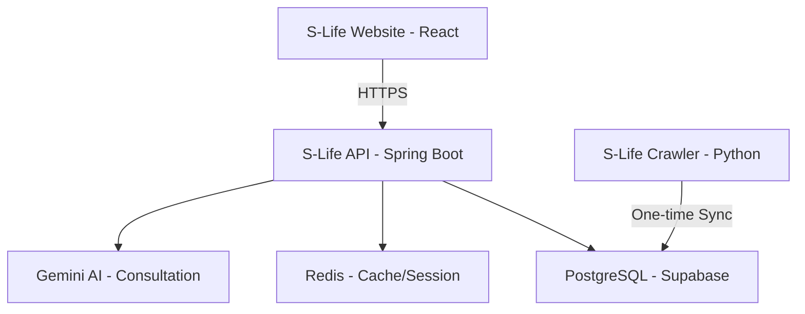

# 📋 ĐẶC TẢ CHI TIẾT DỰ ÁN - S-Life (Health Tech Ecosystem)

## Hệ Sinh Thái Thiết Bị Sức Khỏe & Công Nghệ Thông Minh
---

## 📚 MỤC LỤC

1. [Tổng Quan Dự Án](#1-tổng-quan-dự-án)
2. [Yêu Cầu Chức Năng](#2-yêu-cầu-chức-năng)
3. [Trải Nghiệm Người Dùng (UI/UX)](#3-trải-nghiệm-người-dùng-uiux)
4. [Kiến Trúc Hệ Thống & Crawler](#4-kiến-trúc-hệ-thống--crawler)
5. [Cấu Trúc Dữ Liệu (Database)](#5-cấu-trúc-dữ-liệu-database)
6. [API Endpoints](#6-api-endpoints)
7. [Hệ Thống Xác Thực & Bảo Mật](#7-hệ-thống-xác-thực--bảo-mật)
8. [Công Nghệ Sử Dụng](#8-công-nghệ-sử-dụng)
9. [Quy Trình Triển Khai](#9-quy-trình-triển-khai)

---

## 1. TỔNG QUAN DỰ ÁN

### 1.1 Mô Tả Dự Án

**S-Life** là nền tảng thương mại điện tử thế hệ mới, tiên phong trong việc cung cấp các giải pháp và thiết bị công nghệ hỗ trợ theo dõi sức khỏe chủ động. Dự án tập trung vào các dòng sản phẩm:

- ⌚ **Smartwatches Cao cấp** (Garmin, Apple Watch Series 9/Ultra, Galaxy Watch 6...)
- 🏃‍♂️ **Thiết bị theo dõi vận động** (Fitness Bands, Coros, Fitbit...)
- ⚖️ **Cân sức khỏe thông minh** (Smart Scales, Body Composition Analyzers...)
- 🛡️ **Phụ kiện & Cảm biến chuyên sâu** (Heart rate straps, SpO2 sensors, sạc thông minh...)

Hệ thống được thiết kế với triết lý **"Technology for Better Life"**, kết hợp giữa nền tảng bán hàng chuyên nghiệp và trí tuệ nhân tạo (AI) để tư vấn sức khỏe cá nhân hóa.

### 1.2 Mục Tiêu Dự Án

- **Thương hiệu Nhất quán**: Xây dựng bộ nhận diện S-Life sang trọng, tối giản và hiện đại.
- **Tối ưu Chuyển đổi (Conversion rate)**: Áp dụng các kỹ thuật UI/UX mới nhất (Double Actions, Fast Checkout).
- **Trí tuệ Nhân tạo**: Sử dụng Google Gemini AI để tư vấn thiết bị dựa trên chỉ số sức khỏe của người dùng.
- **Hệ thống Dữ liệu Mạnh mẽ**: Tích hợp hạ tầng Crawler tự động thu thập hàng trăm sản phẩm thương mại thực tế.
- **Hiệu năng Vượt trội**: Tốc độ phản hồi cực nhanh nhờ kiến trúc React Vite và Spring Boot 3 tối ưu.

### 1.3 Phạm Vi Dự Án

| Thành Phần   | Phạm Vi                                             |
| ------------ | --------------------------------------------------- |
| **Frontend** | Premium Web UI (React + Tailwind CSS v4)            |
| **Backend**  | RESTful API (Spring Boot 3.5.6)                     |
| **Crawler**  | S-Life Scraper (Python + BeautifulSoup4)            |
| **Database** | PostgreSQL (Supabase) + Flyway Migrations           |
| **Session**  | Redis (Cart, Fast Search Cache)                     |
| **AI**       | Google Gemini 1.5 Flash (Bác sĩ ảo & Tư vấn thiết bị) |
| **Deploy**   | Docker Containerization                             |

---

## 2. YÊU CẦU CHỨC NĂNG

### 2.1 Chức Năng Khách Hàng (Customer)

#### 2.1.1 Trải Nghiệm Mua Sắm Cao Cấp
- **Fast Live Search**: Thanh tìm kiếm tích hợp trực tiếp trên Header, hiển thị kết quả thời gian thực kèm ảnh và giá.
- **Quick Buy Mode**: Hai nút hành động riêng biệt (MUA NGAY - Chuyển thẳng tới checkout; THÊM VÀO GIỎ - Tiếp tục mua sắm).
- **Phân loại Thông minh**: Lọc sản phẩm theo thương hiệu (Garmin, Apple...) hoặc theo nhu cầu sức khỏe (Chạy bộ, Bơi lội, Theo dõi giấc ngủ).

#### 2.1.2 Quản Lý Tài Khoản & Bảo Mật
- Đăng nhập/Đăng ký với giao diện sạch, hỗ trợ JWT Token và bảo mật đa lớp.
- Quản lý hồ sơ sức khỏe cơ bản để AI đưa ra gợi ý sản phẩm phù hợp.

#### 2.1.3 Thanh Toán & Vận Chuyển
- Tích hợp VNPay, chuyển khoản ngân hàng và COD.
- Hệ thống tính phí vận chuyển và tracking đơn hàng thời gian thực.

### 2.2 Chức Năng Admin (Cổng Quản Trị S-Life)

- **S-Life Dashboard**: Giao diện quản trị hiện đại, thống kê doanh thu và tồn kho thiết bị.
- **Quản lý Sản phẩm**: Chỉnh sửa thông số kỹ thuật (Specs) chuyên sâu cho thiết bị sức khỏe.
- **Hệ thống Seeder**: Khả năng import dữ liệu hàng loạt từ file JSON của Crawler.

---

## 3. TRẢI NGHIỆM NGƯỜI DÙNG (UI/UX)

S-Life áp dụng các quy chuẩn thiết kế **Premium Digital Store**:

1. **Inline Search Bar**: Thay thế overlay cũ bằng thanh tìm kiếm tích hợp sâu vào Navbar, tạo sự liền mạch.
2. **Micro-interactivity**: Sử dụng Framer Motion cho các hiệu ứng hover, chuyển trang và dropdown kết quả tìm kiếm.
3. **Typography & Color**: Sử dụng font chữ Italic Black mạnh mẽ, màu xanh Blue-600 làm chủ đạo, hỗ trợ Dark/Light mode tinh tế.
4. **Fast Checkout Interface**: Giảm thiểu bước trung gian, tập trung vào nút "Mua ngay" để tăng tỷ lệ chốt đơn.

---

## 4. KIẾN TRÚC HỆ THỐNG & CRAWLER

### 4.1 Kiến Trúc Tổng Thể

### 4.2 S-Life Crawler (Standalone Utility)
- **Công cụ**: Python 3.x, BeautifulSoup4, Requests.
- **Mục tiêu**: Thu thập 150+ sản phẩm đồng hồ thông minh thực tế từ các nhà bán lẻ hàng đầu (CellphoneS, FPT Shop).
- **Dữ liệu**: Tên, Thương hiệu, Specs sức khỏe, Ảnh gốc 4K, Giá niêm yết.
- **Bảo mật**: Chạy độc lập và được chặn bởi `.gitignore` để đảm bảo an toàn cho dự án chính.

---

## 5. CÔNG NGHỆ SỬ DỤNG

- **Frontend**: Vite, React 19, Tailwind CSS v4, Lucide Icons, Framer Motion.
- **Backend**: Java 21, Spring Boot 3.5, Spring Security, JPA/Hibernate.
- **Database**: PostgreSQL (v15+), Flyway (Version Control).
- **DevOps**: Docker, Github Actions.

---

Tài liệu này được cập nhật theo định hướng **S-Life - Một Bản sắc, Một Đẳng cấp**. Đảm bảo mọi chi tiết kỹ thuật đều phục vụ mục tiêu chăm sóc sức khỏe khách hàng thông qua công nghệ. 🩺💎⌚
