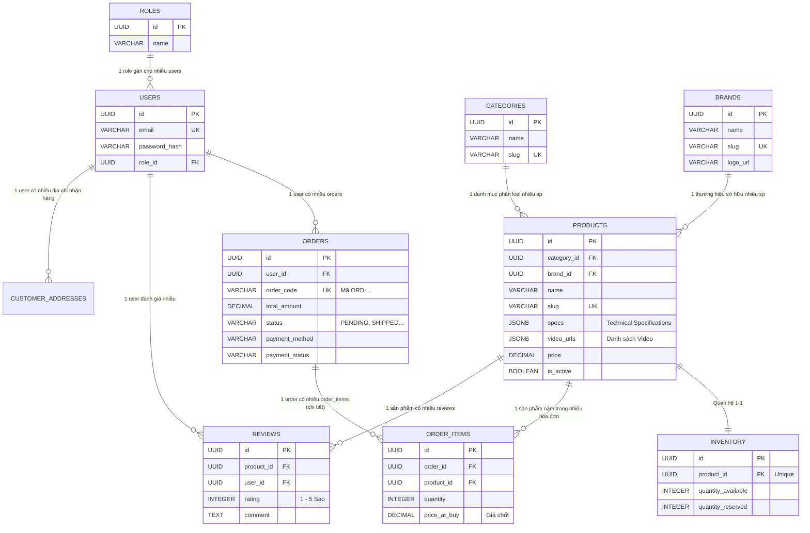

# TechHub Entity-Relationship Diagram (ERD)

Sơ đồ thể hiện hệ thống quan hệ thực thể (ER Model) của dự án.
Dự án áp dụng chặt chẽ các quy chuẩn về toàn vẹn dữ liệu: 1-N (One to Many) và M-N (Many to Many - được cắt bằng bảng trung gian).

## Sơ Đồ Mermaid

## Chú Thích Nghiệp vụ Quan Trọng
1. **Products - Inventory (1:1)**: Tách riêng bảng quản lý tồn kho để ngăn chặn Deadlocks (Xung đột khóa) khi có hàng ngàn user cùng update số lượng sản phẩm mua trong các sự kiện Flash Sale. Tồn kho được lock an toàn trên row trong `inventory`.
2. **Products - Order Items (1:N)**: Cột `price_at_buy` được snapshot tĩnh tại thời điểm khách hàng click thanh toán. Khi Product tăng hay giảm giá ở tương lai, không được phép ảnh hưởng vào tổng tiền của Hoá đơn đã được tạo trong lịch sử.
3. **Database Consistency**: Constraints (Unique, Nullable) đều được áp đặt ở tầng Database, giúp dữ liệu luôn an toàn ngay cả khi Application có bug thoát qua Java validation.